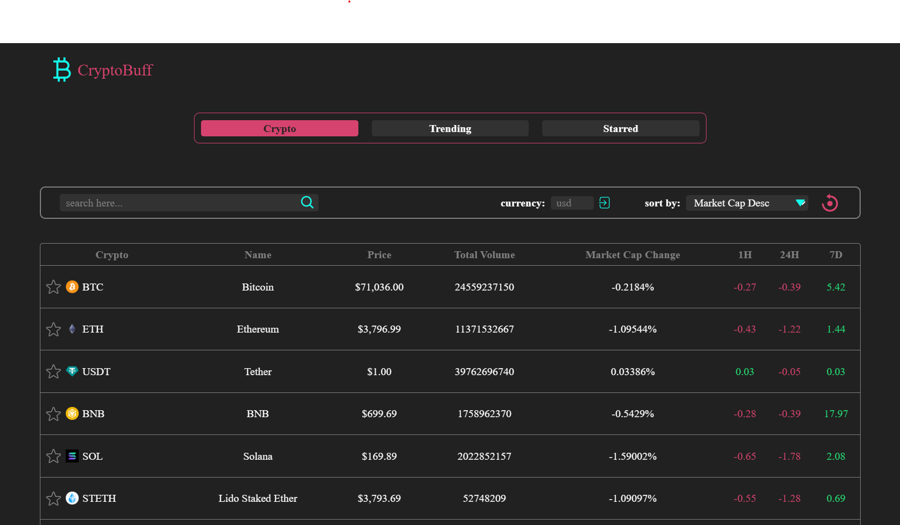
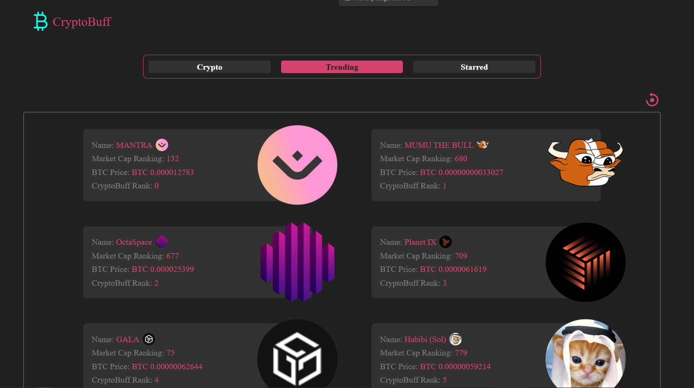
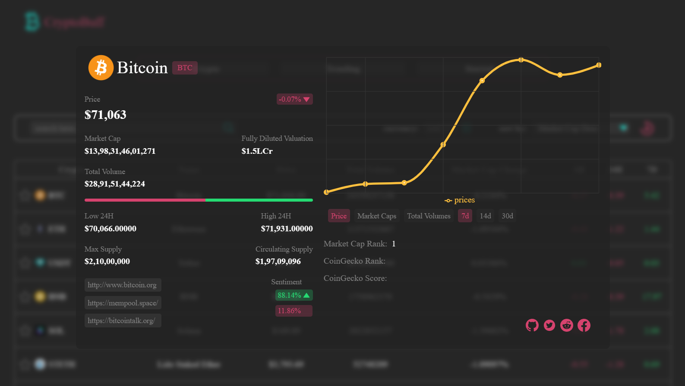

# Main
 &nbsp;     

# Trending

 &nbsp;     

# Details

 &nbsp;     

## RUN
Clone folder and $npm start to compile the environment in a browser

### Resources Used in This Project

- Fonts from https://fonts.google.com/  
- Icons from https://iconify.design/  
- API from https://www.coingecko.com/en/api  

### External Libraries used in this project:

- [Tailwind css](https://tailwindcss.com/)  
- [recharts](https://recharts.org/en-US/)  

